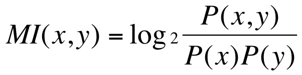

# Assignment 6

This assignment has two parts. The first part is the assignment on mutual information from a while back, the second is on part-of-speech tagging.

### Mutual information

For this part of the assignment you need to find the top 20 collocations in `grail.txt` using the mutual information measure that was discussed in class a while back. Mutual information of two words is defined as follows:



In this formula, `P(x,y)` indicates the probability that word x is immediately followed by word y.

As part of this you need to implement a function `mutual_information()`, which calculates the mutual information of two words in a Text using the formula above. Use this function to get the 20 bigrams with the highest mutual information in a text and compare the results to the results of the `Text.collocations()` method.

1. What are the differences?
2. Can you guess how `Text.collocations()` works?

Experiment with a few ways to get the results of `mutual_information()` to be closer to the result of `Text.collocations()`.

Doing this involves calculating probabilities over a potentially large text, using an auxiliary data structure like `collections.Counter` that you built only once will help. You can hand in that data structure to the function.

We have given some code scaffolding in the package `collocations`, which you should edit. You may change anything there as you please *except that* there needs to be a function named `collocations()` that takes as its sole argument an instance of `nltk.Text` and that prints output to `sys.stdout`, apart from the output nothing else should be printed - do not leave `print` statements from your debugging effort.

More instructions are in `collocations/__init__.py`.


### Part-of-speech tagging

#### Navigating Tagged Corpus

This is partially based on exercises 15 and 18 from chapter 5 of the NLTK Book and also motivated by a "Your Turn" section in that chapter.

Write code to process the Brown Corpus and find answers to the following questions:

1. Which nouns are more common in their plural form, rather than their singular form? (Only consider regular plurals, formed with the -s suffix.)

2. Which word has the greatest number of distinct tags? What are they, and what do they represent?

3. List tags in order of decreasing frequency. What do the 20 most frequent tags represent?

4. Which tags are nouns most commonly found after? What do these tags represent?

In addition, generate some statistics for tagged data to answer the following questions:

1. What proportion of word types are always assigned the same part-of-speech tag?

2. What proportion of word tokens are always assigned the same part-of-speech tag?

Do this by adding code to `postog/brown.py`. Use the code scaffolding as given and do not change the name of methods or the kinds of arguments handed in.  When we look at your code, we will expect that we can import `BrownCorpus` class directly from `postag` package and do the following outside the package.

```
from postag import BrownCorpus

bc = BrownCorpus()
bc.nouns_more_common_in_plural_form()
bc.which_word_has_greatest_number_of_distinct_tags()
bc.tags_in_order_of_decreasing_frequency()
bc.tags_that_nouns_are_most_commonly_found_after(n=5)
bc.proportion_ambiguous_word_types()
bc.proportion_ambiguous_word_tokes()
```

The `postag/__init__.py` given in the starter code is empty, thus the package will not work as above. Your last job in this part would be editing the `__init__.py` so that the package works as expected. 
You may add as many methods, functions and classes as you see fit. You may use any standard module or any method or class from nltk. You do not need to write doc tests or unit tests, but adding good tests can earn you some extra credit. 

#### Traning and Evaluting Taggers

The last part of this assignment is to write your own tagger. This sounds much harder than it is because the nltk module gives you almost everything you need. You should train this tagger on the news category of the Brown Corpus. Create the tagger in `postag/tagger.py`. Your tagger script should be able to do:

1. Train a POS tagging model on "news" portion of the Brown corpus and pickle the model. 
1. Run on a sentence and printing the result to standard output (`sys.stdout`)
1. Print how well this tagger evaluates on sentences from the Brown "news" category
1. Print how well this tagger evaluates on sentences from the Brown "reviews" category

For pickling, you inevitably need to hard-code the path of the pickle jar and re-use the path in test/evaluate functions. 
We provide `run.py`, a command-line interface that wraps around the `tagger.py`. Read the file to figure out what functions (APIs) are required in `tagger.py`

When you look at your code, we would expect

```
$ python run.py --train
$ python run.py -t "Computational linguistics is fun." -n -r 
```

gives us the three test/evaluation points above demonstrated.
